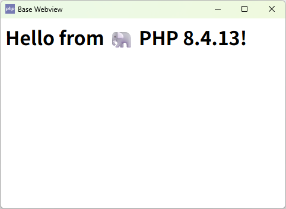
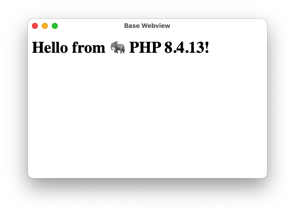
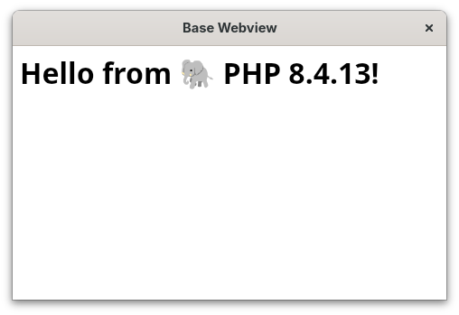

# PHP Webview 扩展

[EN](./README.md) | **中文**

一个原生 PHP 扩展，提供轻量级、跨平台的嵌入式浏览器功能，具有窗口管理特性。基于 [webview/webview](https://github.com/webview/webview) 构建，该扩展使开发者能够使用 Web 技术创建桌面应用程序。

与 [static-php-cli](https://github.com/crazywhalecc/static-php-cli) 和 [phpmicro](https://github.com/dixyes/phpmicro) 结合使用时，非常适合构建单文件 GUI 应用程序。

| Windows | macOS | Linux |
|---------|-------|-------|
|  |  |  |

## 功能特性

- **支持 PHP 版本**：8.3, 8.4, 8.5
- **跨平台**：原生支持 Windows、macOS 和 Linux
- **轻量级**：使用原生 webview 组件，开销最小
- **窗口管理**：
  - `maximize()` / `unmaximize()` - 窗口最大化控制
  - `minimize()` / `unminimize()` - 窗口最小化控制
  - `hide()` / `show()` - 窗口可见性控制
  - `fullscreen($enable = true)` - 全屏模式切换
- **状态监控**：实时窗口状态查询（最大化、最小化、可见、全屏）
- **PHP 集成**：原生扩展，具有适当的错误处理和类型安全

> **API 参考**：查看 [webview.stub.php](./webview.stub.php) 获取完整的方法文档。

## 快速开始

为了快速体验 webview 扩展，可以从 [Releases](https://github.com/happystraw/php-ext-webview/releases) 页面下载预构建的 PHP 可执行文件。

> 本构建只包含少量扩展，如需更多功能请参考下方源码构建和 GitHub Actions 构建。

### Linux/macOS

**CLI：**

```bash
# 1. 下载对应架构的 php-cli-8.4-*.zip
# 2. 解压并设置执行权限
# 3. 运行示例
chmod +x ./php
./php examples/basic.php
```

**Micro：**：

```bash
# 1. 下载对应架构的 php-micro-8.4-*.zip
# 2. 解压并设置执行权限
# 3. 合并成单文件程序并运行
cat micro.sfx examples/basic.php > basic
chmod +x basic
./basic
```

### Windows

> **注意**：Windows 版本使用 UPX 压缩，可能触发杀毒软件警报，请添加信任或自行构建。

**CLI：**

```cmd
REM 1. 下载对应架构的 php-cli-8.4-windows-*.zip
REM 2. 解压到任意目录
REM 3. 运行示例
.\php.exe examples\basic.php
```

**Micro：**

```cmd
REM 1. 下载对应架构的 php-micro-8.4-windows-*.zip
REM 2. 解压到任意目录
REM 3. 合并成单文件程序并运行
COPY /b micro.sfx + examples\basic.php basic.exe
.\basic.exe
```

## 从源码构建

### 前置要求

在构建之前，请确保您的平台已安装所需的依赖项：

- **Linux**：GTK 和 WebKitGTK 开发包
- **macOS**：Xcode 命令行工具
- **Windows**：Visual Studio 构建工具

> **详细要求**：查看 [webview/webview](https://github.com/webview/webview) 获取平台特定的前置要求。

### Linux/macOS

```bash
phpize
./configure --enable-webview
make -j$(nproc)
make install
```

### Windows

按照 [PHP Extensions](https://github.com/php/php-windows-builder?tab=readme-ov-file#php-extensions) 指南在 Windows 上构建 PHP 扩展。

## 使用 GitHub Actions 构建

为了更便捷的构建和分发，你可以 fork 本仓库并使用本仓库中预配置的 GitHub Actions 工作流来自动构建包含 webview 扩展的 PHP CLI/Micro 可执行文件。

### 可用的工作流

- **Build for Unix**：为 Linux（x86_64, aarch64）和 macOS（x86_64, aarch64）构建静态 PHP CLI/Micro 可执行文件
- **Build for Windows**：为 Windows (x86_64) 构建静态 PHP CLI/Micro 可执行文件

## 静态 PHP CLI/Micro 构建

你可以使用 [static-php-cli](https://github.com/crazywhalecc/static-php-cli) 和 [phpmicro](https://github.com/dixyes/phpmicro) 结合使用来构建静态 PHP CLI/Micro 可执行文件。

具体操作可以参考 GitHub Actions 工作流中的 [build-unix.yml](.github/workflows/build-unix.yml) 和 [build-windows.yml](.github/workflows/build-windows.yml) 文件。
